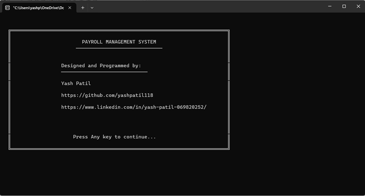
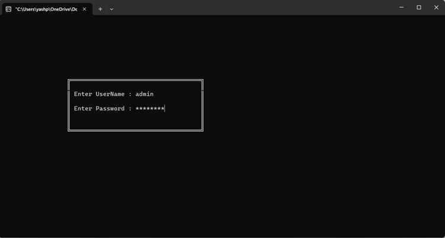
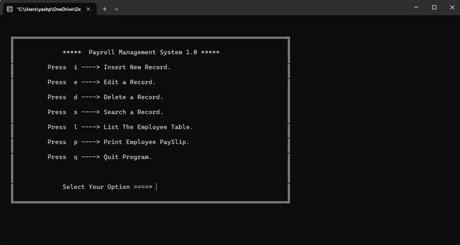
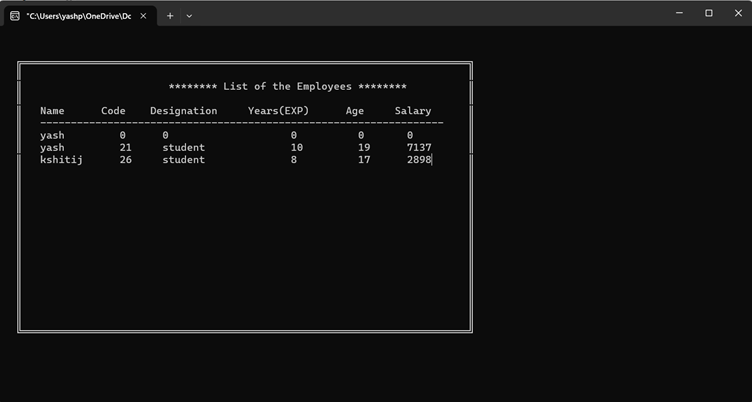
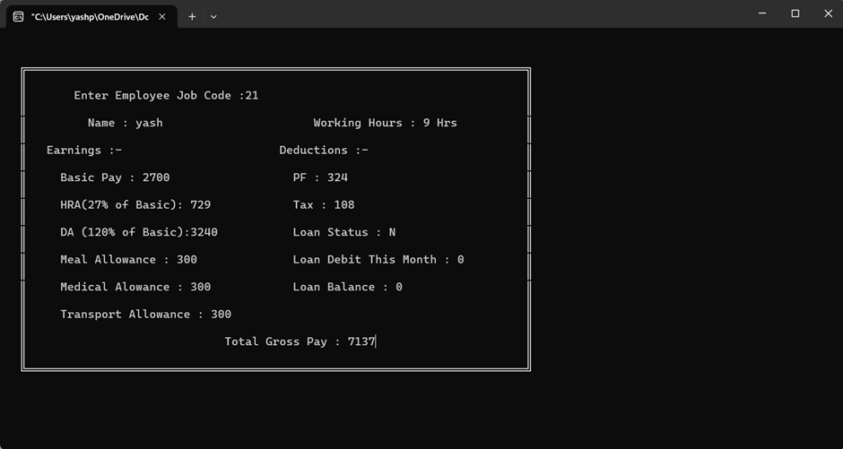

# Payroll Management System  - (Mini-Project)

A comprehensive Payroll Management System built using C++ and Object-Oriented Programming (OOP) concepts. This system provides an efficient solution for managing employee payroll information, salary calculations, and record maintenance.

## 📋 Table of Contents
- [About the Project](#about-the-project)
- [Features](#features)
- [Technologies Used](#technologies-used)
- [System Requirements](#system-requirements)
- [Installation & Setup](#installation--setup)
- [Usage](#usage)
- [Project Structure](#project-structure)
- [OOP Concepts Implemented](#oop-concepts-implemented)
- [Screenshots](#screenshots)
- [Future Enhancements](#future-enhancements)
- [Contributing](#contributing)
- [License](#license)

## 📖 About the Project

The Payroll Management System is a mini project developed in C++ that demonstrates the practical application of Object-Oriented Programming principles. This system allows organizations to efficiently manage employee data, calculate salaries, handle deductions, and maintain comprehensive payroll records.

## ✨ Features

- **Employee Management**
  - Add new employee records
  - Update existing employee information
  - Delete employee records
  - View employee details

- **Payroll Operations**
  - Automatic salary calculation
  - Handle allowances and deductions
  - Generate pay slips
  - Calculate net salary

- **Record Management**
  - Search employee by ID
  - Display all employee records
  - Maintain employee database

- **User-Friendly Interface**
  - Menu-driven console interface
  - Easy navigation
  - Input validation

## 🛠️ Technologies Used

- **Language:** C++
- **Programming Paradigm:** Object-Oriented Programming (OOP)
- **Concepts Used:**
  - Classes and Objects
  - Encapsulation
  - Inheritance
  - Polymorphism
  - Abstraction
  - File Handling

## 💻 System Requirements

- **Compiler:** Any C++ compiler (GCC, MinGW, Turbo C++, Visual Studio, etc.)
- **Operating System:** Windows, Linux, or macOS
- **RAM:** Minimum 512 MB
- **Storage:** 50 MB free space

## 🚀 Installation & Setup

### Step 1: Clone or Download the Project
```bash
git clone https://github.com/yashpatil118/mini-project.git
cd Payroll-Management-System
```

### Step 2: Compile the Program

**Using GCC/G++:**
```bash
g++ payrollManagementSystem.cpp -o payroll
```

**Using MinGW (Windows):**
```bash
g++ payrollManagementSystem.cpp -o payroll.exe
```

**Using Visual Studio:**
- Open the project in Visual Studio
- Build the solution (Ctrl + Shift + B)

### Step 3: Run the Program

**On Linux/macOS:**
```bash
./payroll
```

**On Windows:**
```bash
payroll.exe
```

## 📘 Usage

1. **Launch the Application**
   - Run the compiled executable file

2. **Main Menu Options**
   - Select from various menu options using numeric input
   - Follow on-screen prompts for each operation

3. **Adding Employees**
   - Choose "Add Employee" option
   - Enter required details (ID, Name, Designation, Basic Salary, etc.)

4. **Calculating Payroll**
   - Select employee
   - System automatically calculates gross salary, deductions, and net salary

5. **Viewing Records**
   - Display all employees or search by specific ID
   - View detailed payroll information

6. **Exit**
   - Use the exit option to close the application safely

## 🎯 OOP Concepts Implemented

### 1. **Classes and Objects**
- Employee class encapsulating employee data and operations
- Payroll class for salary calculations

### 2. **Encapsulation**
- Private data members with public member functions
- Data hiding and access control

### 3. **Abstraction**
- Complex salary calculations abstracted from user
- Simple interface for complex operations

### 4. **File Handling**
- Persistent storage of employee records
- Reading and writing data to files

### 5. **Data Validation**
- Input validation for employee data
- Error handling mechanisms

## 📸 Screenshots

### Cover Page


*The cover page the payroll management system.*

### Login Page


*Interface for Login details.*

### Main Menu


*Main menu of the payroll management system*

### Employee Records Display


*Display of all employee records stored in the system.*

### Pay Slip Generation

*Generated pay slip with complete salary breakdown for an employee.*

## 🔮 Future Enhancements

- [ ] Database integration (MySQL/SQLite)
- [ ] Graphical User Interface (GUI)
- [ ] Tax calculation based on different slabs
- [ ] Attendance management integration
- [ ] Export reports to PDF/Excel
- [ ] Multi-user support with authentication
- [ ] Leave management system
- [ ] Bonus and incentive calculations

## 🤝 Contributing

Contributions are welcome! If you'd like to improve this project:

1. Fork the repository
2. Create a feature branch (`git checkout -b feature/AmazingFeature`)
3. Commit your changes (`git commit -m 'Add some AmazingFeature'`)
4. Push to the branch (`git push origin feature/AmazingFeature`)
5. Open a Pull Request

## 📝 License

This project is developed as a mini project for educational purposes. Feel free to use and modify the code for learning and academic purposes.

## 👨‍💻 Author

**Yash Patil*
- GitHub: [@yashpatil118](https://github.com/yashpatil118)

## 🙏 Acknowledgments

- Thanks to all contributors and supporters
- Inspired by real-world payroll management systems
- Built as a learning project to demonstrate OOP concepts in C++

---

**Note:** This is a mini project developed for educational purposes. For production use, consider implementing additional security measures, database integration, and comprehensive error handling.
